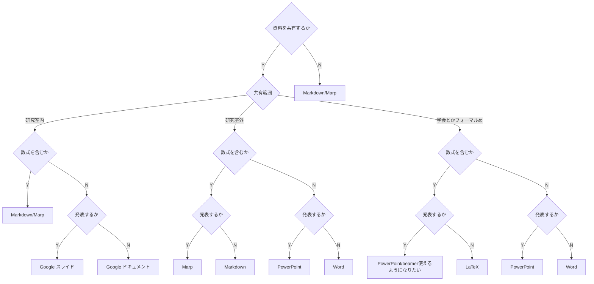
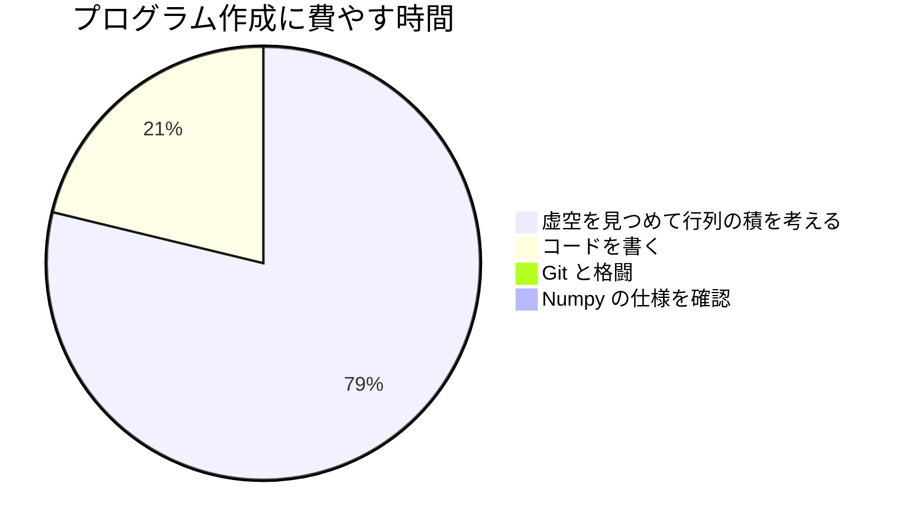

# Mermaid 練習

## 個人的な資料作成ツールの選択フロー

```mermaid
flowchart TD
A{資料を共有するか} -- Y --> BY{共有範囲}
A -- N --> BN[Markdown/Marp]

BY -- 研究室内 --> Ci{数式を含むか}
BY -- 研究室外 --> Co{数式を含むか}
BY -- 学会とかフォーマルめ --> Cf{数式を含むか}

Ci -- Y --> DiY[Markdown/Marp]
Ci -- N --> DiN{発表するか}

Co -- Y --> DoY{発表するか}
Co -- N --> DoN{発表するか}

Cf -- Y --> DfY{発表するか}
Cf -- N --> DfN{発表するか}

DiN -- Y --> EiY[Google スライド]
DiN -- N --> EiN[Google ドキュメント]

DoY -- Y --> EoYY[Marp]
DoY -- N --> EoYN[Markdown]
DoN -- Y --> EoNY[PowerPoint]
DoN -- N --> EoNN[Word]

DfY -- Y --> EfYY[PowerPoint/beamer使えるようになりたい]
DfY -- N --> EfYN[LaTeX]
DfN -- Y --> EfNY[PowerPoint]
DfN -- N --> EfNN[Word]
```

## プログラム作成に費やす時間

```mermaid
pie
title プログラム作成に費やす時間
"虚空を見つめて行列の積を考える" : 78
"コードを書く" : 21
"Git と格闘" : 0.1
"Numpy の仕様を確認" : 0.03
```
